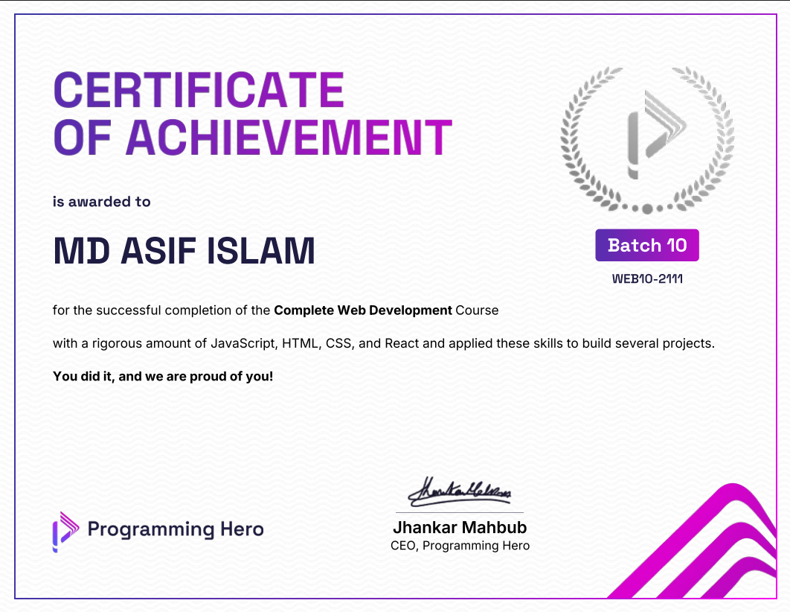

<h1 align="center">Hi 👋, I'm Asif Islam Bisal</h1>
<h3 align="center">A creative frontend developer from the heart of Bangladesh 🇧🇩, crafting user-friendly web interfaces with passion and precision.</h3>

<<<<<<< HEAD

=======

>>>>>>> b3b2d47d6ea109e143d7e021400231c7464696a1

  

- 🔭 What I'm Working On: [**Product Hunt**](https://product-hunt-f43f1.web.app/)
- 🌱 Currently Leveling Up In: **📘 Next.js • TypeScript • Tailwind CSS Best Practices • JavaScript**
- 👯 I’m looking to collaborate on: [**The Hungry Fox**](https://crave-craft.web.app/)
- 🤝 I’m looking for help with: [**BlueSky Residences**](https://hotel-booking-project-aa7bf.web.app/)
- 📝 I regularly write articles on: [**LinkedIn**](https://linkedin.com/in/asif-islam-bisal-2b7902317)
- 💬 Feel Free To Ask Me About: **🧠 React • Frontend Problems • Firebase Integration**
- 📫 How to reach me: **bisalasif@gmail.com**
- 📄 Know about my experiences: [**Portfolio**](https://asif-islam-bisal.vercel.app/)
- ⚡ Fun fact: **I treat every pixel like a puzzle piece — placing it perfectly is my favorite kind of fun! 🎨🧩**

---

<h3 align="left">Connect with me:</h3>

  
  
  

---

<h3 align="left">Languages and Tools:</h3>

  
  
  
  
  
  
  
  
  
  

---

<h3 align="left">📊 GitHub Stats:</h3>

  

  &nbsp;

  

---

<h3 align="left">📈 Activity Graph:</h3>

  

---

  ⭐ If you like my work, consider giving a star to my repositories!

